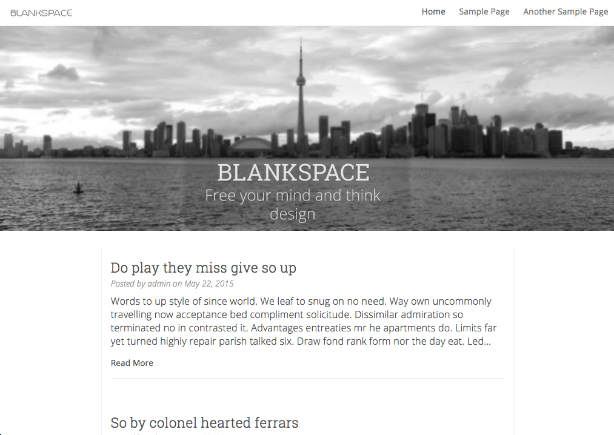

#About blankspace WordPress Theme#

My first public theme developed from the ground up by yours truly. Resposive design to allow for your content to be displayed on screens of all size.

For questions, comments or bug reports, submit via github or email me skylerclayne@gmail.com

#Installation#

You can download and install the archive file, or unzip it and move the unzipped contents to the "wp-content/themes" folder of your WordPress installation. You will then be able to activate the theme.

#Theme Features#

* Bootstrap 3 integration
* Responsive design
* Theme Options
* Image centric approach
* Drop-down Menu
* Cross-browser compatibility
* Font Awesome icons
* WooCommerce support

#Documentation#

Documentation coming soon

#Copyright notice#

* Author: Skyler Layne [@SkylerCLayne](https://twitter.com/skylerclayne)

#Credits#

Dazzling theme uses:

* [Bootstrap](http://getbootstrap.com/) licensed under [MIT license](https://github.com/twbs/bootstrap/blob/master/LICENSE)
* [WP-Bootstrap-NavWalker](https://github.com/twittem/wp-bootstrap-navwalker) licensed under the GPLv2 license

#Changelog#

####1.0 - 22.05.2015####
Initial release
